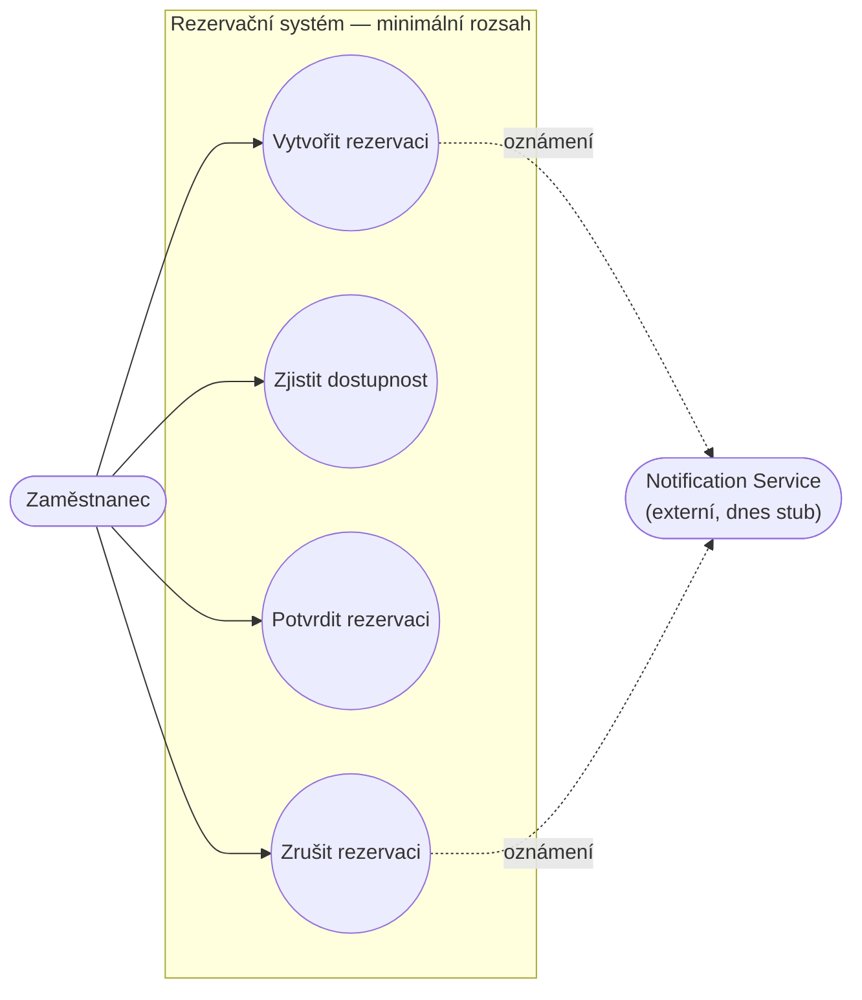
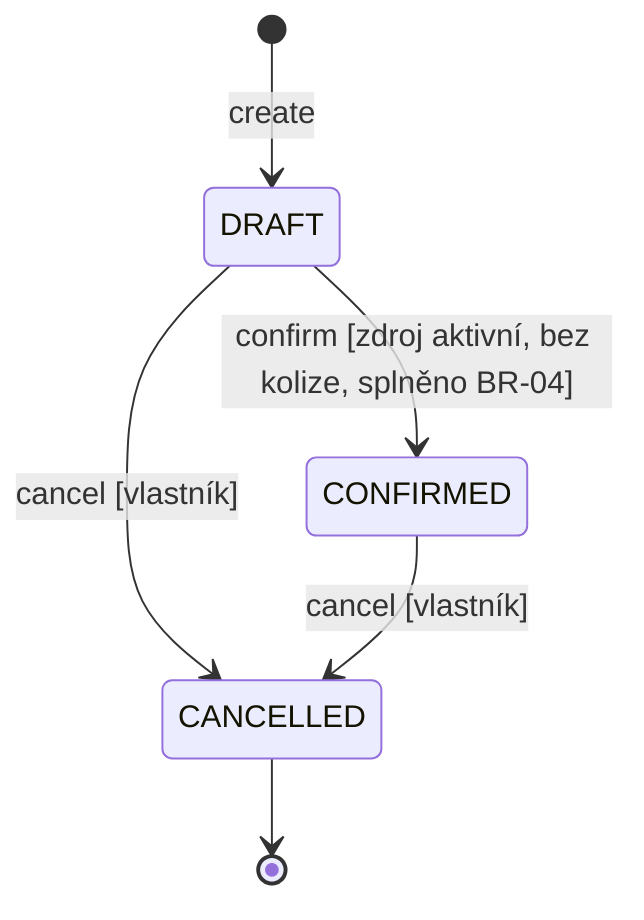
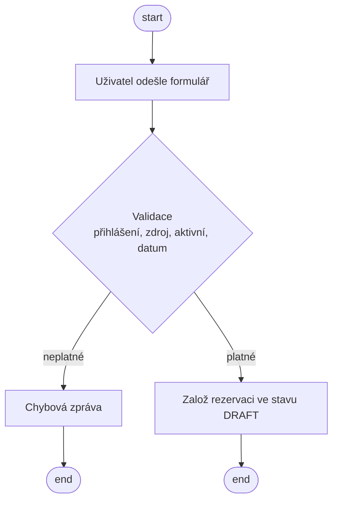
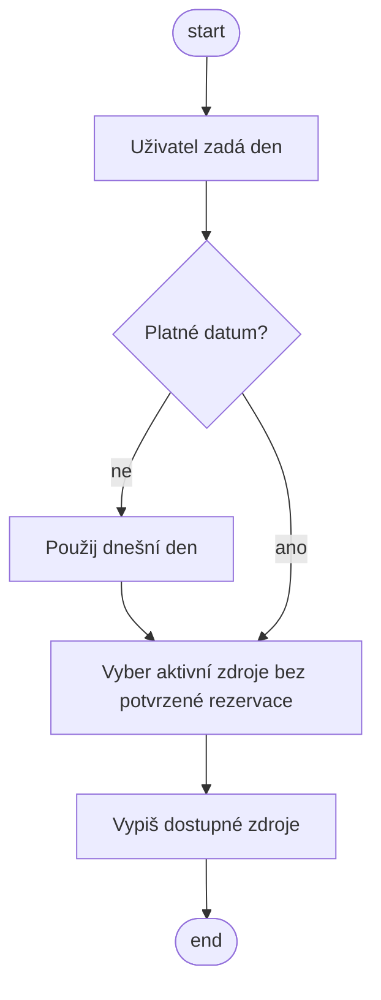
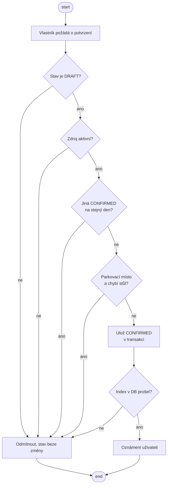
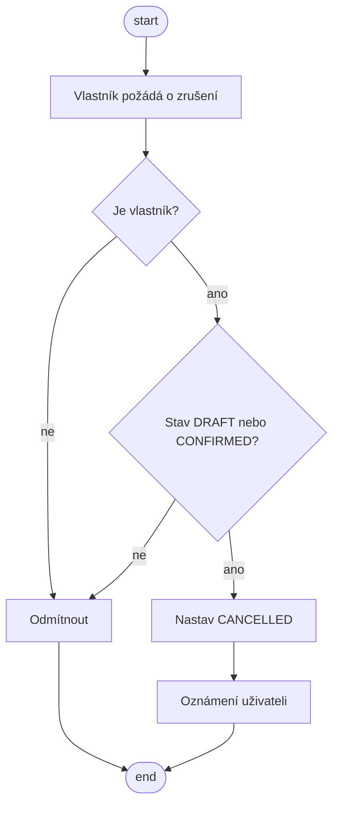
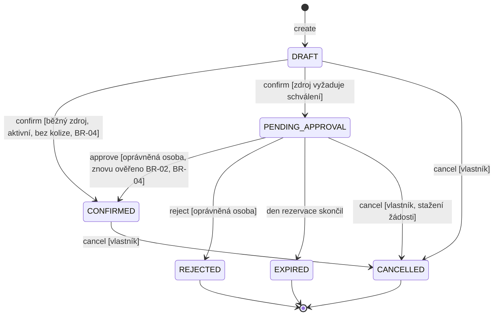
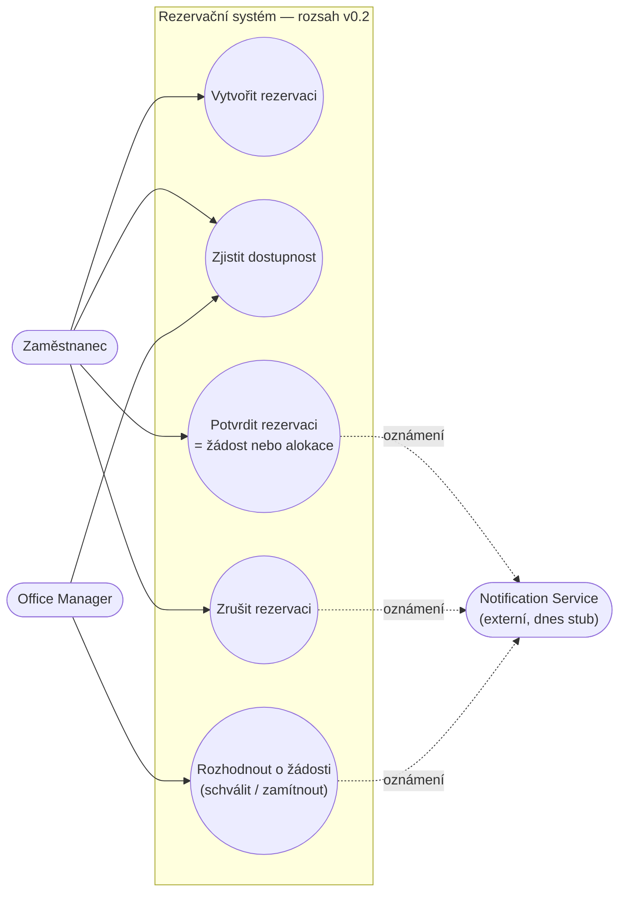

# Project Frame

## Reservation domain
Pracovní místa k sezení a parkovací místa v rámci firemních prostor.

## Purpose
Systém slouží zaměstnancům firmy k plynulému a organizovanému plánování dnů v open office prostředí. Cílem je eliminovat stres z nedostatku pracovních a parkovacích míst a zabránit rannímu chaosu při nekoordinovaných příchodech.

## Users / Stakeholders
- Employee (Zaměstnanec – vyhledává dostupnost, vytváří a spravuje své vlastní rezervace).

- Office Manager (Admin – spravuje zdroje, přidává nové stoly/parkovací místa, řeší konflikty).

## Core concepts
- Reservation
- Resource (Desk nebo Parking Spot)
- User

## Core operations
- Create reservation: Založí novou rezervaci.

- Confirm / approve reservation: Zvaliduje pravidla a rezervaci závazně potvrdí.

- Cancel reservation: Zruší rezervaci a uvolní zdroje pro ostatní.

- Check availability: Zjistí, jaké stoly a parkovací místa jsou volná pro zadané datum.

## Persistent state
- Reservation ukládáme: ID rezervace, User ID (kdo rezervuje), Resource ID (co rezervuje), datum (date), časový slot (pokud je podporován, jinak celodenní), stav rezervace (status).

- Resource ukládáme: ID zdroje, typ zdroje (Desk / Parking Spot), označení/lokace (např. "Stůl A12" nebo "Místo P4"), stav zdroje (aktivní/vyřazený z provozu).

## State-changing operation
- Drafting: null → DRAFT (Při volání Create reservation)

- Confirmation: DRAFT → CONFIRMED (Při volání Confirm reservation)

- Cancellation: CONFIRMED → CANCELLED (Při volání Cancel reservation)

## Common business rule
Confirmed reservations for the same resource must not overlap.

## Domain-specific business rule
Uživatel si smí vytvořit a potvrdit rezervaci parkovacího místa na konkrétní den pouze tehdy, pokud již má (nebo současně v jedné transakci vytváří) potvrzenou rezervaci pracovního místa k sezení na ten samý den.

## External / system boundary
Notification Service – Externí závislost, která asynchronně odesílá uživatelům potvrzení o úspěšném vytvoření nebo zrušení rezervace.

## Assumption
Předpokládáme, že zaměstnanci budou své rezervace poctivě stornovat, pokud zjistí, že do kanceláře nakonec nedorazí. Systém tak nebude uměle blokován.

## Unknown
Neznáme potřebnou kapacitu.

---

# C02 — Specifikace minimálního chování

Tato část popisuje **celé minimální chování systému**: čtyři základní operace, doménová pravidla a dva pohledy na systém. Vzniká ve dvou krocích: nejdřív **baseline v0.1** (stav, který odpovídá běžící aplikaci), pak **změna C02** (schvalovací proces) a **baseline v0.2**.

Kde se co nachází (mapování na zadání C02):

| Krok zadání | Sekce tohoto dokumentu |
| --- | --- |
| 1–2 čtyři operace se strukturou | `### OP-01` … `OP-04` |
| 3 kontrola přijetí požadavků | `### Kontrola přijetí požadavků` |
| 4–7 referenční příklady | použity jako forma jednotlivých OP |
| 8 doménová pravidla a invarianty | `### Doménová pravidla a invarianty` |
| 9a/9b/9c diagramy | `### 9a`, `9b`, `9c` |
| 10 kontrola konzistence | `### 10 Kontrola konzistence` |
| 11 aplikace podle baseline | běžící aplikace `reservations/` |
| 12–13 změna a baseline v0.2 | `# Změna C02` a `# Baseline v0.2` |
| 15 evidence | `docs/evidence-and-evolution.md` |

## Slovník pojmů

| Pojem | Význam v tomto systému |
| --- | --- |
| Rezervace | Záznam záměru uživatele použít konkrétní zdroj v konkrétní den. |
| Zdroj (Resource) | Exkluzivní stůl nebo parkovací místo. V jednom dni patří nejvýše jednomu uživateli. |
| Aktivní zdroj | `Resource.is_active = True`. Vyřazený zdroj se nesmí rezervovat ani potvrdit. |
| **Alokace** | Stav, kdy rezervace blokuje zdroj pro ostatní. V baseline v0.1 nastává **výhradně** ve stavu `CONFIRMED`. |
| Den rezervace | Kalendářní datum `reservation_date`. Konflikt dvou rezervací = stejný zdroj **a** stejný den. |
| Vlastník | Uživatel, který rezervaci vytvořil (`reservation.user`). |
| Stavy rezervace | `DRAFT` (návrh), `CONFIRMED` (platná alokace), `CANCELLED` (zrušeno, koncový stav). |

## OP-01 — Vytvoření rezervace (Create Reservation)

**Cíl / hodnota pro uživatele:** Uživatel si poznamená záměr rezervovat zdroj na daný den, aniž by cokoli blokoval. Když si to rozmyslí, nic se nerozbije.

**Spouštěcí událost:** Přihlášený uživatel odešle formulář „vytvořit návrh“ u vybraného zdroje a dne.

**Pozorovatelný požadavek:**

> **REQ-01:** Systém vytvoří rezervaci ve stavu `DRAFT` pro existující aktivní zdroj, když je zadaný den platné datum.

**Předpoklady:**
- uživatel je přihlášen (`@login_required`),
- zdroj existuje (validace formuláře pro vytvoření rezervace),
- zdroj je aktivní,
- `reservation_date` je platné datum.

**Stav po úspěšném provedení:**
- existuje právě jedna nová rezervace ve stavu `DRAFT` s daným vlastníkem, zdrojem a dnem;
- zdroj **není** alokován — dostupnost pro ostatní uživatele se nemění;
- existující rezervace ostatních zůstávají beze změny.

**Změna stavu:** `[žádný]` → `DRAFT`

**Odkaz na doménová pravidla:** BR-01 (význam dne).

**Hlavní úspěšný scénář:**
1. Uživatel si vybere den a u volného zdroje odešle formulář.
2. Systém ověří přihlášení, existenci zdroje, jeho aktivnost a platnost dne.
3. Systém založí rezervaci ve stavu `DRAFT`.
4. Systém zobrazí potvrzení o vytvoření návrhu.

**Alternativní / chybové výsledky:**
- nepřihlášený uživatel → přesměrování na přihlášení, nic se nevytvoří;
- neexistující nebo neaktivní zdroj → odmítnuto, nic se nevytvoří;
- neplatné datum → odmítnuto, nic se nevytvoří.
- Souběh: dva uživatelé mohou mít na stejný zdroj a den současně `DRAFT`. To je **záměr** — `DRAFT` nealokuje, o zdroj se soutěží až v OP-03.

**Příklady ověření:** (skutečně spuštěné, viz Evidence C02)
- aktivní zdroj + volný den → vznikne jeden `DRAFT`;
- neaktivní zdroj → `ReservationError`, počet rezervací se nezmění;
- již potvrzený zdroj → `DRAFT` vznikne (dostupnost se filtruje v OP-02, ne zde).

**Zdůvodnění / zdroj:** Vytvoření zaznamenává záměr bez alokace zdroje; odpovídá Project Frame („Create reservation: Založí novou rezervaci“) i referenčnímu příkladu OP-01 v zadání.

**Předpoklad:** Nevyzvednuté návrhy nikoho neblokují, proto se neuklízejí a nemají expiraci.

**Implementace:** `services.create_draft`; v uživatelském rozhraní ji od baseline v0.3 vyvolává `create_reservation` přes `POST /reservations/create/` (viz „Baseline v0.3“ níže).

## OP-02 — Zjištění dostupnosti (Check Availability)

**Cíl / hodnota pro uživatele:** Uživatel zjistí, které zdroje jsou na daný den volné, ještě než cokoli vytvoří.

**Spouštěcí událost:** Přihlášený uživatel otevře stránku dostupnosti, případně s parametrem `?date=` (např. po odeslání formuláře).

**Pozorovatelný požadavek:**

> **REQ-02:** Systém pro zadaný den vypíše zdroje, které jsou aktivní a nemají na tento den žádnou potvrzenou rezervaci. Neaktivní zdroje a zdroje obsazené potvrzenou rezervací ve výpisu nejsou.

**Předpoklady:** uživatel je přihlášen; zadaný den je platné datum.

**Stav po úspěšném provedení:** je vrácen výpis dostupných zdrojů, **žádný stav se nemění**.

**Odkaz na doménová pravidla:** BR-01, BR-02 (blokuje pouze `CONFIRMED`).

**Hlavní úspěšný scénář:**
1. Uživatel si vybere den.
2. Systém vybere aktivní zdroje, které na daný den nemají potvrzenou rezervaci.
3. Systém vypíše dostupné zdroje a uživatelovy vlastní rezervace na ten den.

**Alternativní / chybové výsledky:**
- neplatné datum → systém použije dnešní den a stránku zobrazí (nejde o chybu; uživatel tak vždy vidí nějaký smysluplný stav).

**Příklady ověření:** (skutečně spuštěné, viz Evidence C02)
- zdroj s `CONFIRMED` na daný den → ve výpisu není;
- zdroj pouze s `DRAFT` → ve výpisu je (návrh neblokuje);
- neaktivní zdroj → ve výpisu není nikdy;
- neplatné datum → použije se dnešní den.

**Zdůvodnění / zdroj:** Stejná definice „blokuje“ jako v OP-03 (BR-02). Kdyby dostupnost považovala za blokující i `DRAFT`, uživatel by u zdroje viděl obsazeno, i když si ho ještě nikdo nezajistil.

**Implementace:** `services.available_resources_for_date`, `views.availability`, URL `GET /`.

## OP-03 — Potvrzení rezervace (Confirm Reservation)

**Cíl / hodnota pro uživatele:** Z návrhu se stane platná alokace zdroje, na kterou se dá spolehnout.

**Spouštěcí událost:** Vlastník požádá o potvrzení své rezervace.

**Pozorovatelné požadavky:**

> **REQ-03:** Systém potvrdí rezervaci ve stavu `DRAFT` jen tehdy, když je její zdroj aktivní a na daný den pro něj neexistuje jiná potvrzená rezervace.
>
> **REQ-04:** Při souběžných potvrzeních, která si odporují podle BR-02, dosáhne stavu `CONFIRMED` nejvýše jedno z nich.
>
> **REQ-05:** (doménové pravidlo) Parkovací místo lze potvrdit jen tehdy, když má stejný uživatel na stejný den potvrzený stůl.

**Předpoklady:** rezervace existuje; její stav je `DRAFT`; potvrzuje ji vlastník.

**Stav po úspěšném provedení:**
- rezervace je ve stavu `CONFIRMED`;
- rezervace blokuje zdroj pro daný den (naplňuje BR-02);
- vzniká oznámení pro uživatele (dnes zapsané do logu).

**Změna stavu:** `DRAFT` → `CONFIRMED`

**Odkaz na doménová pravidla:** BR-02, BR-04.

**Alternativní / chybové výsledky:**
- neaktivní zdroj → odmítnuto, rezervace zůstává `DRAFT`;
- existuje kolize s potvrzenou rezervací → odmítnuto, rezervace zůstává `DRAFT`;
- parkovací místo bez potvrzeného stolu → odmítnuto, rezervace zůstává `DRAFT`;
- rezervace v jiném stavu než `DRAFT` → odmítnuto, stav beze změny;
- cizí rezervace → přístup odmítnut (403), stav beze změny;
- souběh dvou potvrzení → druhé skončí chybou, jeho rezervace zůstává `DRAFT`.

**Příklady ověření:** (skutečně spuštěné, viz Evidence C02)
- `DRAFT` + aktivní zdroj + volný den → `CONFIRMED`;
- `DRAFT` + kolize s `CONFIRMED` → odmítnuto, zůstává `DRAFT`;
- parkovací místo před potvrzením stolu → odmítnuto; po potvrzení stolu → `CONFIRMED`.

**Zdůvodnění / zdroj:** Potvrzení je okamžik, kdy vzniká alokace. Proto jsou všechny kontroly kolizí až zde, ne při vytváření (viz OP-01).

**Předpoklad:** Oznámení je dnes jen záznam do logu (`services.notify_reservation_event`), nikoli skutečná externí služba — architektonický driver pro C03.

**Implementace:** `services.confirm_reservation` (v transakci, se zámkem řádku), `views.confirm_reservation_view`, URL `POST /reservations/<pk>/confirm/`.

## OP-04 — Zrušení rezervace (Cancel Reservation)

**Cíl / hodnota pro uživatele:** Uživatel se vzdá rezervace a uvolní zdroj ostatním.

**Spouštěcí událost:** Vlastník požádá o zrušení své rezervace.

**Pozorovatelný požadavek:**

> **REQ-06:** Systém zruší rezervaci svého vlastníka ve stavu `DRAFT` nebo `CONFIRMED`.

**Předpoklady:** rezervace existuje; stav je `DRAFT` nebo `CONFIRMED`; žadatel je vlastník.

**Stav po úspěšném provedení:**
- rezervace je ve stavu `CANCELLED`;
- rezervace přestává blokovat zdroj (u `DRAFT` nikdy neblokovala);
- záznam zůstává v databázi i s historií.

**Změna stavu:** `DRAFT` → `CANCELLED`, `CONFIRMED` → `CANCELLED`

**Odkaz na doménová pravidla:** BR-03.

**Alternativní / chybové výsledky:**
- cizí rezervace → odmítnuto, stav beze změny;
- stav `CANCELLED` → odmítnuto (operace **není** idempotentní, což je vědomé rozhodnutí);
- jiný stav → odmítnuto.

**Příklady ověření:** (skutečně spuštěné, viz Evidence C02)
- `CONFIRMED` vlastníka → `CANCELLED` a zdroj je opět dostupný;
- `DRAFT` vlastníka → `CANCELLED`;
- cizí rezervace → odmítnuto;
- opakované zrušení → odmítnuto.

**Zdůvodnění / zdroj:** „Zrušit“ neznamená smazat — stav `CANCELLED` zachovává dohledatelnost. Politika je rozhodnutí týmu (BR-03).

**Předpoklad:** Časová hranice rušení se nevyhodnocuje, protože celodenní rezervace nemá definovaný čas začátku (přijaté zjednodušení, viz BR-01 a BR-03).

**Implementace:** `services.cancel_reservation`, `views.cancel_reservation_view`, URL `POST /reservations/<pk>/cancel/`.

## Doménová pravidla a invarianty

Pravidla platí napříč operacemi, proto jsou definovaná **jen zde** a jednotlivé operace na ně odkazují.

> **BR-01 — Význam intervalu (celodenní granularita)**
> Rezervace pokrývá jeden celý kalendářní den. Dvě rezervace si konkurují právě tehdy, když mají stejný zdroj a stejný `reservation_date`. Časový slot uvnitř dne modelován není, proto se nevyhodnocuje žádná časová hranice.
> *Zdroj:* rozhodnutí C01 („datum, časový slot pokud je podporován, jinak celodenní“). Nahrazuje referenční interval `[start,end)` z příkladu v zadání.

> **BR-02 — Invariant exkluzivity zdroje**
> V žádném okamžitém stavu nesmí existovat dvě potvrzené rezervace stejného zdroje na stejný den. Zdroj pro ostatní blokuje **pouze** stav `CONFIRMED`; `DRAFT` ani `CANCELLED` dostupnost nemění.
> *Vynucení:* kontrola ve službě `confirm_reservation` **a** částečný unikátní index `unique_confirmed_resource_date` (`status = 'CONFIRMED'`) v databázi, který pravidlo drží i při souběžných požadavcích.

> **BR-03 — Politika rušení**
> Zrušit lze rezervaci ve stavu `DRAFT` nebo `CONFIRMED`, a to pouze její vlastník. Zrušení je nevratné (`CANCELLED` je koncový stav) a opakované zrušení je odmítnuto. Čas se nevyhodnocuje.
> *Zdroj:* rozhodnutí týmu v C02.

> **BR-04 — Parkovací místo vyžaduje potvrzený stůl** (doménové pravidlo z C01)
> Parkovací místo lze potvrdit jen tehdy, když má stejný uživatel na stejný den už potvrzený stůl.
> *Vynucení:* `user_has_confirmed_desk` uvnitř `confirm_reservation`.
> *Neznámá:* C01 zmiňuje i variantu „nebo současně v jedné transakci vytváří“ — aplikace nepotvrzuje více rezervací najednou, proto tato část zatím nemá chování. TBD pro případ přidání košíku.

## Kontrola přijetí požadavků

Otázky ze zadání jsme neopisovali pod každý požadavek; odpovědi platí pro celou baseline a odlišnosti jsou výslovně uvedené.

| Otázka | Jak je vyřešena |
| --- | --- |
| **Význam** | Slovník pojmů výše definuje „alokace“, „den rezervace“, „aktivní zdroj“. Klíčové hranice: blokuje **jen** `CONFIRMED` (BR-02), den = celý kalendářní den (BR-01). |
| **Potřeba / zdůvodnění** | Každá operace má sekci „Zdůvodnění“. REQ-04 (souběh) neexistuje „pro jistotu“: bez něj by dva souběžné požadavky mohly vytvořit dvojí alokaci téhož zdroje. |
| **Pozorovatelný výsledek** | REQ-01…REQ-06 popisují pozorovatelný výsledek (stav rezervace, obsah výpisu dostupnosti), ne způsob implementace. Výjimkou jsou názvy stavů, které jsou součástí doménového modelu už z C01. |
| **Proveditelnost** | Požadavky jsou splnitelné společně: jediné, co blokuje, je `CONFIRMED`, a k `CONFIRMED` vede jediná cesta přes kontroly v OP-03. |
| **Ověřitelnost** | Každá operace má příklady ověření a všechny byly spuštěny (viz `docs/evidence-and-evolution.md`). Souběh v REQ-04 je pokryt testem, který simuluje dvě potvrzení. |
| **Stav / čas** | Význam závisí na stavu rezervace a na dni. Hranice uvnitř dne neexistuje (BR-01), takže se nikde nevyhodnocuje čas — to je vědomé zjednodušení, ne opomenutí. |
| **Souběh** | REQ-04 + BR-02: dvě souběžná potvrzení téhož zdroje na stejný den → nejvýše jedno `CONFIRMED`; drží databázový index, ne jen kontrola v aplikaci. |
| **Konzistence** | Zkontrolováno v sekci 10 níže, včetně nalezeného rozporu mezi textem a kódem. |
| **Nejistota** | Kapacita zdrojů zůstává neznámou z C01 (systém kapacitu neřeší). Oznámení je stub. Varianta „nebo současně v jedné transakci“ u BR-04 je TBD. Nic z toho není potichu domyšlené. |

## 10 Kontrola konzistence

| Kontrola | Výsledek |
| --- | --- |
| Create vs. Confirm | **V pořádku.** Create nealokuje (OP-01), alokaci vytváří až Confirm (OP-03). Shodné i s BR-02 a s testem, který vytváří `DRAFT` na již obsazený den. |
| Availability vs. Confirm | **V pořádku.** Obě operace považují za blokující jen `CONFIRMED` (REQ-02, REQ-03). |
| Cancel vs. stavový diagram | **Nalezený rozpor.** Specifikace (REQ-06, BR-03) dovoluje zrušit `DRAFT` i `CONFIRMED`, ale kód (`services.cancel_reservation`) dosud dovoloval jen `CONFIRMED`. Rozhodnutí týmu: platí specifikace, kód se opravuje — zrušením návrhu nesmí vzniknout slepá ulička. |
| Význam intervalu | **V pořádku.** Celodenní granularita je použita v OP-01, OP-02, BR-01 i v ověření. |
| Diagram případů užití vs. text | **V pořádku.** Čtyři cíle pro čtyři operace, žádný cíl bez specifikovaného chování. |
| Požadavek vs. návrhové rozhodnutí | **Rozlišeno.** Použití PostgreSQL (Supabase) není požadavek na chování, ale architektonické rozhodnutí s vlastním záznamem v `docs/architecture-and-decisions.md`. Specifikace žádnou technologii nepředepisuje. |
| Nejistota vs. vymyšlená přesnost | Kapacita zůstává TBD. Konkrétní hodnoty (např. lhůta schválení v části B) pocházejí z rozhodnutí týmu, ne z odhadu nástroje. |
| Dokumentace vs. realita | **Nalezený nesoulad:** `README.md` uvádí test `WalkingSkeletonReservationCreateTests` z definice CP1, který v repu zatím není. Podle README je jeho implementace plánovaná na C03 — do té doby jde o známý rozdíl, ne o chybějící prvek C02. |

## 9a Diagram případů užití — aktéři a cíle

Office Manager je v C01 uvedený jako stakeholder, ale v minimálním rozsahu v0.1 nemá vlastní cíl: zdroje spravuje mimo minimální chování (Django admin). Vlastní cíl získává až změnou C02 (schvalování) — viz baseline v0.2.

## 9b Stavový diagram životního cyklu rezervace (v0.1)

Diagram odpovídá textu: `CANCELLED` je koncový stav, `CONFIRMED` se nedá „odpotvrdit“ (jen zrušit) a přechod do `CONFIRMED` je podmíněný pravidly BR-02 a BR-04.

## 9c Diagramy aktivit

**OP-01 Vytvoření rezervace**

**OP-02 Zjištění dostupnosti**

**OP-03 Potvrzení rezervace**

**OP-04 Zrušení rezervace**

## Stav baseline v0.1

**Specification Baseline v0.1** — obsah výše odpovídá běžící aplikaci `reservations/` kromě jednoho nalezeného rozporu (rušení `DRAFT`, viz sekce 10), který se opravuje v kódu, aby platila specifikace.

*Stav: k odsouhlasení týmem. Po review tým dopíše „schválená týmem“ a datum.*

---

# Změna C02 — schvalovací proces

**Zadání změny:** Některé zdroje vyžadují schválení oprávněnou osobou dříve, než se rezervace může stát `CONFIRMED`. Schválení může být opožděno, zamítnuto nebo může vypršet.

Následuje **analýza dopadu**. Kód se podle zadání mění až po ní.

## 12 Analýza dopadu

| Oblast | Otázka | Odpověď pro náš systém |
| --- | --- | --- |
| **Create** | Mění se Create, nebo stále jen vytváří `DRAFT`? | **Nemění se.** Vzniká stále `DRAFT`, jen u některých zdrojů vede potvrzení jinam (viz Confirm). Zdůvodnění: kdyby Create rovnou zakládal žádost o schválení, uživatel by nemohl připravit rezervaci dopředu a rozmyslet si ji. |
| **Availability** | Blokuje `PENDING_APPROVAL` zdroj? Proč? | **Neblokuje.** Blokovat smí jen `CONFIRMED`, protože jen ten je platná alokace (BR-02). Kdyby žádost blokovala, jeden nevyřízený požadavek by zablokoval zdroj pro všechny, aniž by kdokoli něco získal — a vznikla by otázka, co s blokací při vypršení. |
| **Confirm** | Je Confirm stále okamžitá operace? | Pro zdroje bez požadavku na schválení **ano, beze změny**. Pro zdroje, které schválení vyžadují, Confirm vytvoří žádost: `DRAFT` → `PENDING_APPROVAL`. Rozhodnutí týmu: zůstává **jedna** operace Confirm se dvěma možnými výsledky, protože z pohledu uživatele jde pořád o „potvrdit rezervaci“. |
| **Approve** | Vzniká nový cíl aktéra / nová operace? | **Ano.** Vzniká operace *Rozhodnutí o žádosti* (approve/reject) a nový cíl aktéra **Office Manager**. Nový stav `PENDING_APPROVAL` (a `REJECTED`, `EXPIRED`) do té doby nemělo kdo obsloužit. |
| **Cancel** | Lze zrušit `PENDING_APPROVAL`? | **Ano.** Rozhodnutí týmu: vlastník může stáhnout i nevyřízenou žádost. Bez toho by uživatel, který si to rozmyslel, musel čekat na schvalovatele nebo na vypršení. |
| **Stavový diagram** | Potřebujeme nové stavy? | **Ano** — `PENDING_APPROVAL`, `REJECTED`, `EXPIRED`. Samostatný stav `APPROVED` nepotřebujeme: schválení přechází přímo do `CONFIRMED`, který už znamená alokaci. |
| **Diagram případů užití** | Přibyl nový aktér nebo cíl? | **Ano** — poprvé se v minimálním rozsahu objevuje Office Manager s cílem schválit/odmítnout žádost. |
| **Ověření** | Jak ověříme zpoždění, zamítnutí, vypršení? | Zpoždění: rezervace zůstává `PENDING_APPROVAL` a zdroj je přitom stále v nabídce dostupnosti. Zamítnutí: přechod do `REJECTED`. Vypršení: žádost na minulý den se při čtení přesune do `EXPIRED`. Každé má vlastní příklad ověření. |
| **Architektura** | Vzniká architektonický driver? | **Ano, hned několik** — viz „Architektonické drivery pro C03“ na konci. |

## 13 Baseline v0.2

Mění se jen to, co změna skutečně zasahuje. Vše ostatní platí z v0.1.

### Změněné požadavky

- **REQ-03** (OP-03) se mění: potvrzení rezervace zdroje, který **vyžaduje schválení**, rezervaci nepotvrdí, ale vytvoří žádost ve stavu `PENDING_APPROVAL`. Pro ostatní zdroje platí původní znění.
- **REQ-06 / BR-03** se mění: zrušit lze `DRAFT`, `PENDING_APPROVAL` i `CONFIRMED`, a to vlastníkem. Zbytek politiky (nevratnost, opakované zrušení odmítnuto, bez časové hranice) platí dál.

### Nová doménová pravidla

> **BR-05 — Schvalování vyhrazených zdrojů**
> Zdroj s `requires_approval = True` (ve výchozím stavu vypnuto, nastavuje Office Manager) nelze potvrdit okamžitě: potvrzení takového zdroje vytvoří žádost, o které rozhoduje oprávněná osoba. Rozhodnutí má tři možné výsledky: schválení (`CONFIRMED`), zamítnutí (`REJECTED`) a vypršení (`EXPIRED`).
> *Vyhrazení zdroje je rozhodnutí manažera, ne vlastnost typu zdroje* — proto příznak na zdroji, ne pravidlo odvozené z `resource_type`. Běžné stoly i parkovací místa se tak chovají jako dosud.

> **BR-06 — Vypršení žádosti**
> Žádost ve stavu `PENDING_APPROVAL` vyprší na konci dne, na který je rezervace: jakmile je `reservation_date` v minulosti, systém žádost přesune do `EXPIRED`. Vyhodnocuje se při čtení (bez úlohy běžící na pozadí) — systém tedy nemá samostatný časovač.
> *Zdroj:* rozhodnutí týmu v C02 („do konce dne, na který je rezervace“). Lhůta se počítá z `reservation_date`, proto ji nelze zaměnit s dobou vyřízení.

> **BR-07 — Schválení znovu ověřuje pravidla**
> Schválení je nový okamžik alokace, takže se v něm znovu ověřuje BR-02 (žádná jiná potvrzená rezervace stejného zdroje a dne) a BR-04 (parkovací místo vyžaduje potvrzený stůl). Pokud pravidlo neplatí, schválit nelze a žádost zůstává `PENDING_APPROVAL`, aby ji bylo možné zamítnout s vysvětlením.

### OP-05 — Rozhodnutí o žádosti (Approve / Reject Reservation)

**Cíl / hodnota pro uživatele:** Uživatel se dozví, jestli mu vyhrazený zdroj byl přidělen, a Office Manager má kde rozhodovat.

**Spouštěcí událost:** Oprávněná osoba (Office Manager) schválí nebo zamítne žádost ve stavu `PENDING_APPROVAL`.

**Pozorovatelné požadavky:**

> **REQ-07:** Systém schválí žádost (přechod do `CONFIRMED`) jen tehdy, když je zdroj aktivní, neexistuje jiná potvrzená rezervace téhož zdroje na tentýž den a platí BR-04.
>
> **REQ-08:** Systém na pokyn oprávněné osoby přesune žádost do `REJECTED`. Zamítnutí je nevratné.
>
> **REQ-09:** Systém přesune žádost do `EXPIRED`, jakmile skončil den, na který rezervace je.
>
> **REQ-10:** Rozhodnout o žádosti smí jen oprávněná osoba (Office Manager); ostatní uživatelé jsou odmítnuti a stav se nemění.

**Předpoklady:** rezervace existuje; její stav je `PENDING_APPROVAL`; žadatel je oprávněná osoba.

**Stav po úspěšném provedení:**
- schválení: `CONFIRMED`, zdroj je alokován uživateli, vzniká oznámení;
- zamítnutí: `REJECTED`, zdroj zůstává volný, vzniká oznámení;
- vypršení: `EXPIRED`, zdroj zůstává volný.

**Změna stavu:** `PENDING_APPROVAL` → `CONFIRMED`, `PENDING_APPROVAL` → `REJECTED`, `PENDING_APPROVAL` → `EXPIRED`

**Odkaz na doménová pravidla:** BR-02, BR-04, BR-05, BR-06, BR-07.

**Hlavní úspěšný scénář:**
1. Manager otevře frontu žádostí.
2. Systém vyhodnotí vypršené žádosti a vypíše ty, které čekají na rozhodnutí.
3. Manager u žádosti zvolí schválit.
4. Systém znovu ověří BR-02, BR-04 a aktivnost zdroje.
5. Systém uloží `CONFIRMED` a zapíše oznámení pro uživatele.

**Alternativní / chybové výsledky:**
- zdroj mezitím vyřazen z provozu → schválit nelze, žádost zůstává `PENDING_APPROVAL`;
- mezitím potvrzená jiná rezervace téhož zdroje a dne → schválit nelze, žádost zůstává `PENDING_APPROVAL`;
- parkovací místo a mezitím zrušený stůl → schválit nelze, žádost zůstává `PENDING_APPROVAL`;
- žádost už vypršela nebo je v jiném stavu → odmítnuto, stav beze změny;
- neoprávněný uživatel → přístup odmítnut, stav beze změny;
- souběžné schválení dvou žádostí téhož zdroje → nejvýše jedna `CONFIRMED` (BR-02, index v DB).

**Příklady ověření:** (skutečně spuštěné, viz Evidence C02)
- žádost na vyhrazený zdroj → `PENDING_APPROVAL`, nikoli `CONFIRMED`;
- manager schválí → `CONFIRMED`, zdroj je obsazen;
- manager zamítne → `REJECTED`, zdroj je volný;
- žádost na minulý den → při čtení `EXPIRED`;
- schválení parkovacího místa po zrušení stolu → odmítnuto, zůstává `PENDING_APPROVAL`;
- běžný uživatel se pokusí schválit → odmítnuto;
- `PENDING_APPROVAL` neblokuje dostupnost (zdroj je stále ve výpisu).

**Zdůvodnění / zdroj:** Zadání změny C02 („schválení může být opožděno, zamítnuto nebo může vypršet“). Schválení je nový okamžik alokace, proto se v něm pravidla ověřují znovu (BR-07) — mezi požádáním a rozhodnutím se totiž stav světa mohl změnit.

**Implementace:** `services.decide_approval` (schválit/zamítnout), `services.expire_stale_approvals`, `views.approvals`, URL `GET /approvals/` a `POST /approvals/<pk>/`.

### Aktualizovaný stavový diagram (v0.2)

### Aktualizovaný diagram případů užití (v0.2)

### Co se nezměnilo (a proč)

| Nedotčená část | Proč |
| --- | --- |
| OP-01 Create, celý scénář i chyby | Změna se týká až okamžiku potvrzení; vytvoření návrhu má pořád stejný význam. |
| OP-02 Check Availability (REQ-02) | `PENDING_APPROVAL` záměrně neblokuje, takže definice „blokuje jen CONFIRMED“ zůstává doslova stejná. |
| BR-01 celodenní interval | Vypršení žádosti se počítá z `reservation_date`, časové sloty se nezavádějí. |
| BR-02 exkluzivita zdroje + index v DB | Pravidlo se nemění, jen se nově ověřuje i při schválení (BR-07). |
| BR-04 parkovací místo vyžaduje stůl | Platí dál a nově se kontroluje i při schválení. |
| Kompletní OP-04 Cancel (scénáře) | Mění se jen výčet povolených stavů (REQ-06); pravidla vlastnictví a nevratnosti platí dál. |
| Slovník pojmů, aktéři, hranice systému | Změna nepřidává nový pojem ve smyslu zdroje ani novou hranici systému. |
| Architektura úložiště (PostgreSQL/Supabase) | Doménová změna se úložiště netýká; nové stavy jsou jen hodnoty existujícího sloupce `status`. |

## Architektonické drivery pro C03

1. **Notifikace jako skutečná externí závislost.** Dnes `services.notify_reservation_event` jen zapíše do logu. Nové události (žádost, zamítnutí, vypršení) znamenají, že se okruh notifikací rozšířil — C03 bude řešit, kde má notifikační hranice být a co s neúspěšným odesláním.
2. **Čas bez časovače.** Vypršení žádostí (BR-06) se vyhodnocuje při čtení. Je to jednoduché, ale roste riziko, že se na stav „čeká na vypršení“ zapomene. C03: patří časová logika do doménové služby, nebo potřebujeme plánovač?
3. **Pravidlo na dvou místech.** BR-02 je vynucené v aplikaci i v databázi. Duplikace je záměrná (databáze drží souběh), ale C03 musí vysvětlit, které vynucení je primární, a držet je v souladu.
4. **Dvě role a jedna kontrola oprávnění.** Vzniká druhá role (Office Manager). Dnes by se oprávnění kontrolovalo na více místech — C03 má rozhodnout, kde je jediné místo pro rozhodnutí „smí tento uživatel schvalovat“.
5. **Walking skeleton z CP1 není hotový.** `POST /reservations` s odpovědí `201` a JSON tělem (definice v README) v aplikaci chybí, stejně jako test `WalkingSkeletonReservationCreateTests`. Patří do C03.
6. **Nový stav = nová kombinace.** Stavy `REJECTED` a `EXPIRED` jsou koncové a nesmí se z nich potvrzovat ani zrušovat. C03: jak zajistit, aby se pravidla o povolených přechodech nedala obejít na jiném místě kódu.

---

# Baseline v0.3 — rezervace jedním krokem

**Rozhodnutí týmu (26. 9. 2026):** uživatel nechce návrh potvrzovat zvlášť. Jeden klik na zdroj a den znamená rezervaci.

**Změněná podmínka:** OP-01 a OP-03 se v uživatelském rozhraní provádějí jako **jedna akce**. Služba `create_reservation` rezervaci vytvoří a v téže transakci na ni použije pravidla potvrzení, takže uživatel stav `DRAFT` nikdy nevidí.

| Dotčená část | Změna |
| --- | --- |
| OP-01 Create Reservation | Tlačítko se jmenuje **Reserve**. Výsledkem jednoho kliknutí je rezervace ve stavu `CONFIRMED`, nebo `PENDING_APPROVAL` u zdroje, který vyžaduje schválení (BR-05). |
| OP-03 Confirm Reservation | Není už samostatný krok uživatele: vyvolává ho OP-01 ve stejné transakci. Pravidla REQ-03, REQ-04 a REQ-05 se kontrolují ve stejném okamžiku a na jednom místě kódu. |
| Stavový diagram | Přechod `[žádný] → DRAFT → CONFIRMED` proběhne v jedné transakci; `DRAFT` je v tomto toku přechodný a není pozorovatelný. |
| Chybové výsledky OP-01 | Selže-li některá z kontrol, nezůstane po pokusu **žádná** rezervace. Dřív po neúspěšném potvrzení zůstal osiřelý `DRAFT`. |
| Příklady ověření | Přidána třída `CreateReservationTests` (jedna akce → `CONFIRMED`; schvalovaný zdroj → `PENDING_APPROVAL`; kolize a BR-04 → neuloží se nic) a testy tlačítka `Reserve`. |

**Nedotčené části a proč:**

- OP-02 Check Availability — dostupnost se pořád počítá jen z `CONFIRMED`, definice se nemění.
- OP-04, OP-05 a BR-01…BR-07 — mění se jen to, že na začátku stojí potvrzená rezervace místo návrhu; politika rušení i schvalování zůstávají doslova stejné.
- **Stav `DRAFT` i operace Confirm zůstávají v modelu a ve specifikaci.** Jsou to dvě ze čtyř základních operací a Project Frame uvádí `DRAFT` jako výchozí stav; zároveň by jejich zrušením zmizela část, která se má v C02 hodnotit. Rozhraní je v běžném toku nespojuje do dvou kroků, ale obojí zůstává dosažitelné přes službu a přes Django admin (rezervace založená jako `DRAFT` se dá později potvrdit), takže se to dá i nadále předvést a ověřit.

**Důsledek pro souběh:** dvě souběžná kliknutí na stejný zdroj a den skončí tak, že druhé ohlásí chybu a neuloží nic. Drží to částečný unikátní index `unique_confirmed_resource_date`, ne kontrola před zápisem.

**Doplnění kontroly konzistence:** řádek „Create vs. Confirm“ už není nález, ale **popsaná politika** — Create sám nealokuje, alokaci provede Confirm vyvolaný ve stejné transakci.